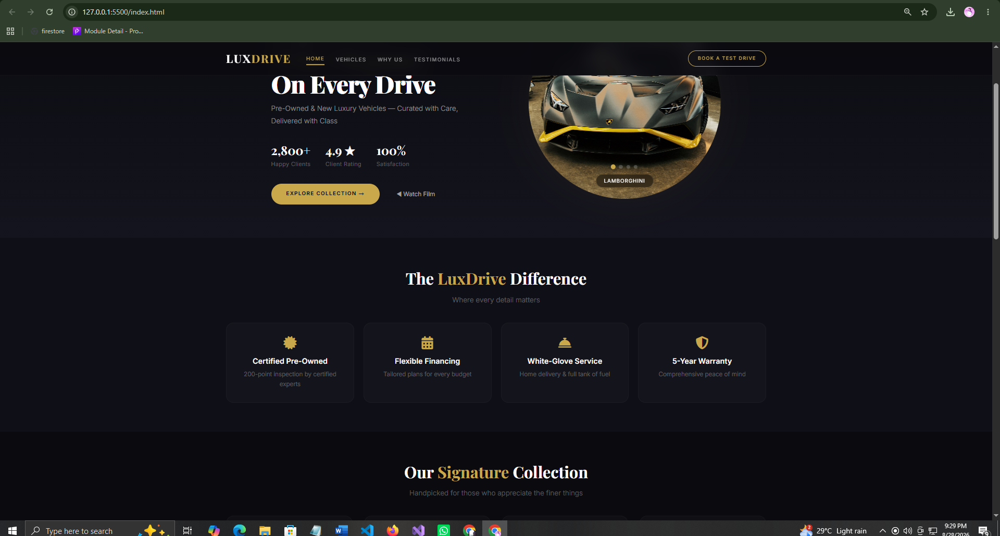
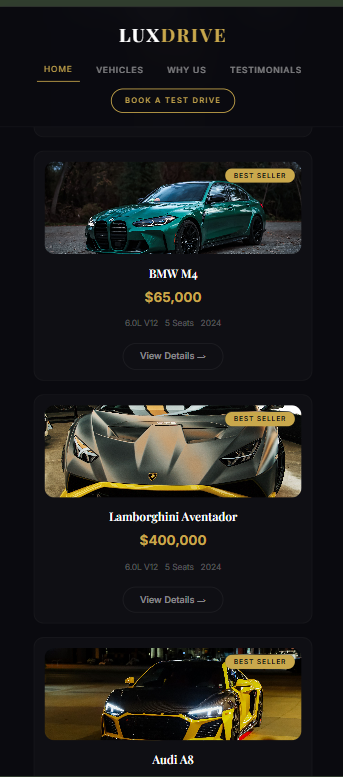
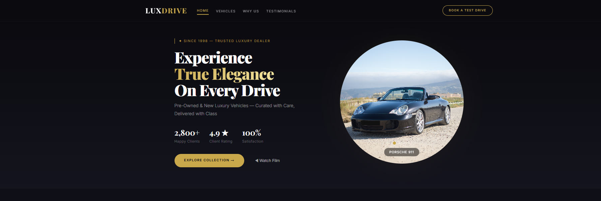

<div align="center">
  
# 🚀 OIBSIP — Oasis Infobyte Internship
  


> *"Learning is the only thing the mind never exhausts, never fears, and never regrets."*  
> — **Leonardo da Vinci**

</div>

---

## 📖 About The Project

This repository contains all the tasks I completed during my **Web Development Internship** at **Oasis Infobyte**. Each task is organized in separate folders following the strict naming convention required by the internship.

| 📋 Detail             | 📌 Info                             |
| :-------------------- | :---------------------------------- |
| **Internship Period** | August 2026                         |
| **Track**             | Web Development & Designing         |
| **Level Chosen**      | Level 1 (3 Tasks)                   |
| **Technology**        | Pure HTML + CSS (No JavaScript)     |
| **Status**            | ✅ Completed                        |

---

## 🚀 Task 1: Landing Page

### **LuxDrive — Premium Car Dealer Landing Page**

A visually stunning, fully responsive landing page for a luxury car dealership. Built with pure HTML and CSS, featuring an auto-sliding image carousel, smooth scrolling, and an elegant dark theme.

---

### ✨ Key Features

<details>
<summary><b>📌 Click to expand all features</b></summary>

| #  | Feature                  | Description                             |
| -- | ------------------------ | --------------------------------------- |
| 1  | **Sticky Navigation**    | Smooth scroll with hover animation      |
| 2  | **Hero Section**         | Tagline, headline, and CTA buttons      |
| 3  | **Auto-Sliding Carousel**| 5 luxury car images with labels         |
| 4  | **Live Stats**           | Happy Clients, Rating, Satisfaction     |
| 5  | **Features Section**     | Certified, Financing, Service, Warranty |
| 6  | **Signature Collection** | 4 car cards with specs and prices       |
| 7  | **Testimonials**         | Client reviews with star ratings        |
| 8  | **Call-to-Action**       | Book a Test Drive banner                |
| 9  | **Footer**               | Social links & newsletter subscription  |
| 10 | **Fully Responsive**     | Desktop, Tablet, Mobile                 |
| 11 | **Pure HTML + CSS**      | No JavaScript used                      |
| 12 | **Dark Elegant Theme**   | Gold accents on navy background         |
| 13 | **Navbar Hover Effect**  | Text moves up on hover                  |

</details>

---

### 🛠️ Technologies Used

<p align="center">
  
  
  
  
  
  
</p>

---

### 📸 Screenshots

**💻 Desktop View**
<p align="center">
  
</p>

**📱 Mobile & Carousel View**
<p align="center">
  
  
</p>

---

### 🎥 Video Demo

[▶️ **Click Here to Watch the Landing Page Demo Video**](https://github.com/TahminaKhanNipa10-Codes/OIBSIP/raw/main/WebDev-L1-LandingPage/LandingPages.mp4)

---

### 🌐 Live Demo

<p align="center">
  <a href="[https://tahminakhanNipa10-codes.github.io/OIBSIP/WebDev-L1-LandingPage/](https://tahminakhanNipa10-codes.github.io/OIBSIP/WebDev-L1-LandingPage/)">
    
  </a>
</p>

🔗 **Direct Link:** [https://tahminakhanNipa10-codes.github.io/OIBSIP/WebDev-L1-LandingPage/](https://tahminakhanNipa10-codes.github.io/OIBSIP/WebDev-L1-LandingPage/)

---

### 📁 Folder Structure

```text
OIBSIP/
└── WebDev-L1-LandingPage/
    ├── images/
    │   ├── audi.jpg
    │   ├── bentley.jpg
    │   ├── bmw7.jpg
    │   ├── bmwM4.jpg
    │   ├── ferrari.jpg
    │   ├── lamborghini.jpg
    │   ├── lexus.jpg
    │   ├── mercedes.jpg
    │   ├── mercedes_benz.jpg
    │   └── porsche.jpg
    ├── screenshots/
    │   ├── desktop.png
    │   ├── mobile.png
    │   └── carousel.png
    ├── index.html
    ├── style.css
    └── README.md
