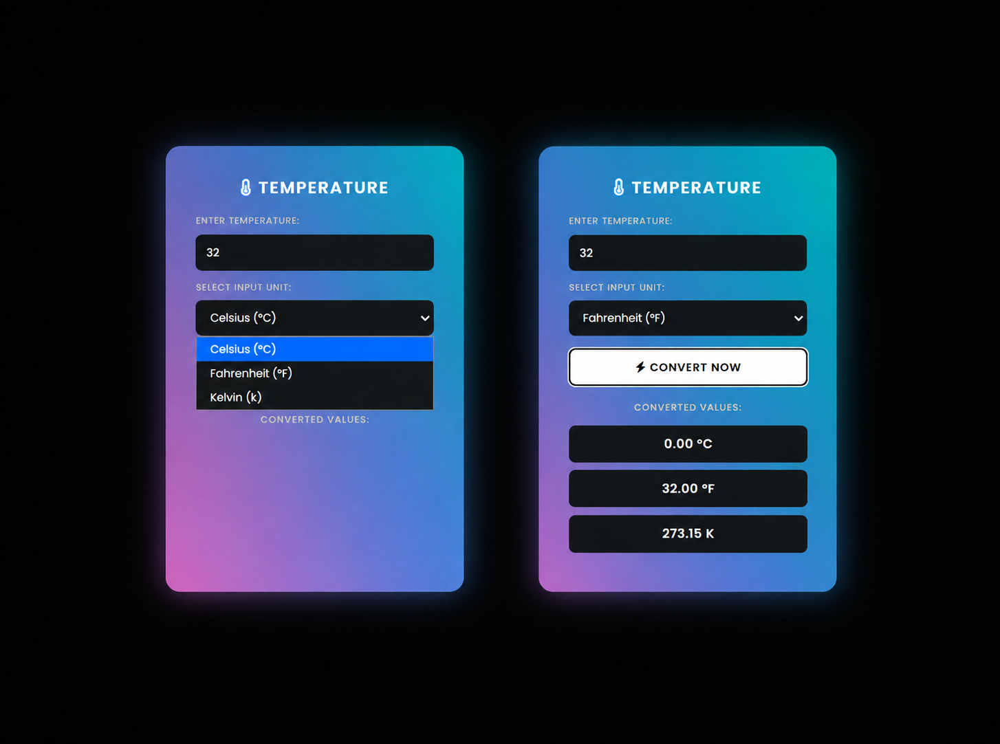
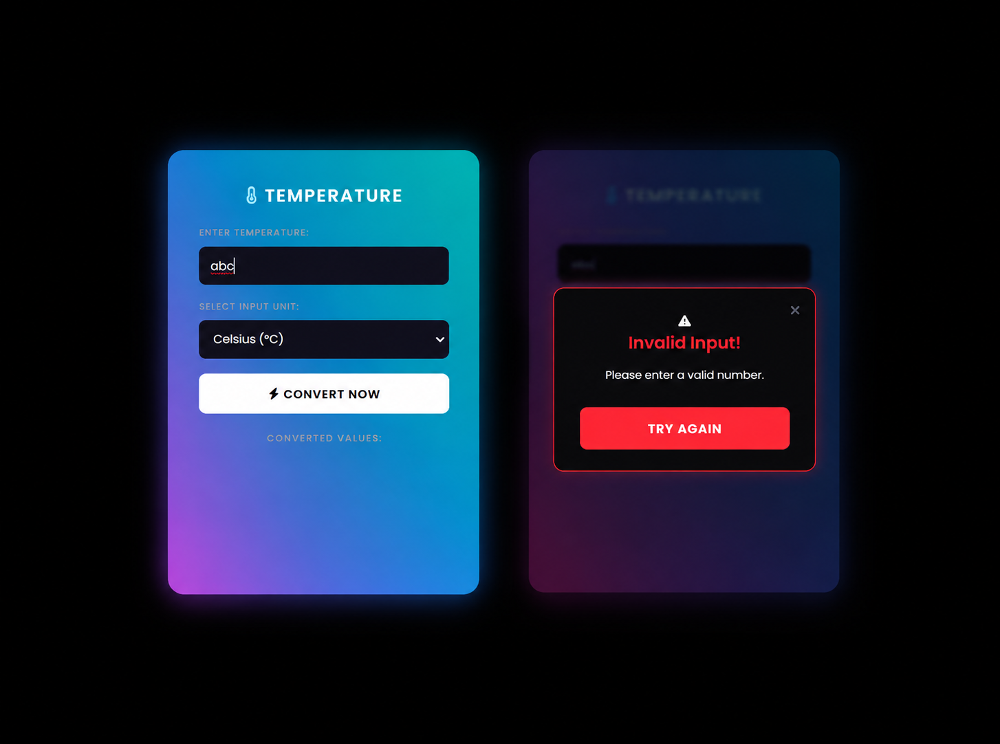
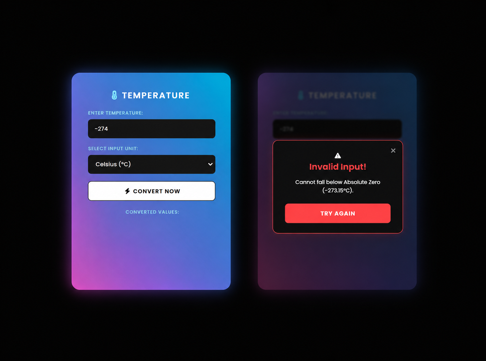

<div align="center">
  
# 🚀 OIBSIP — Oasis Infobyte Internship
  


> *"To measure is to know."*  
> — **Lord Kelvin**

</div>

---

## 📖 About The Project

This repository contains the **Level 1 - Task 3** project completed during my **Web Development Internship** at **Oasis Infobyte**. The project is a sleek, responsive utility web application designed for real-time temperature conversions across multiple units.

| 📋 Detail | 📌 Info |
|:----------|:--------|
| **Internship Period** | August 2026 |
| **Track** | Web Development & Designing |
| **Task** | Level 1 - Task 3 (Temperature Converter) |
| **Technology** | HTML5, CSS3, Vanilla JavaScript |
| **Status** | ✅ Completed |

---

## 🚀 Task 3: Temperature Converter

A modern utility tool that provides instant, precise temperature conversions between Celsius, Fahrenheit, and Kelvin, wrapped in an interactive Cyber/Neon themed UI.

<p align="center">
  
</p>

---

### ✨ Key Features

<details>
<summary><b>📌 Click to expand all features</b></summary>

| # | Feature | Description |
|---|---------|-------------|
| 1 | **Real-Time Conversion** | Inputs are instantly converted as the user types using JavaScript input event listeners. |
| 2 | **Multi-Unit Support** | Accurate conversions between Celsius (°C), Fahrenheit (°F), and Kelvin (K). |
| 3 | **Modern Cyber UI** | Visually appealing Neon/Cyber themed design with smooth gradients and glowing effects. |
| 4 | **Float Precision** | Handles floating-point numbers seamlessly with `toFixed()` for clean output formatting. |
| 5 | **Input Validation** | Prevents invalid characters and ensures empty inputs reset all fields cleanly. |
| 6 | **Fully Responsive** | Flexbox layout perfectly adapting to mobile, tablet, and desktop viewing. |

</details>

---

### 🛠️ Technologies Used

<p align="center">
  
  
  
  
  
</p>

---

### 📸 Screenshots

<p align="center">
  
  
  
</p>

---

### 🌐 Live Demo

<p align="center">
  <a href="https://tahminakhanNipa10-codes.github.io/OIBSIP/WebDev-L1-TemperatureConverter/">
    
  </a>
</p>

🔗 **Direct Link:** [https://tahminakhanNipa10-codes.github.io/OIBSIP/WebDev-L1-TemperatureConverter/](https://tahminakhanNipa10-codes.github.io/OIBSIP/WebDev-L1-TemperatureConverter/)

---

### 📁 Folder Structure
```text
OIBSIP/
└── WebDev-L1-TemperatureConverter/
    ├── index.html
    ├── style.css
    ├── script.js
    ├── README.md
    └── screenshots/
        ├── main.png
        └── invalid.png
        └── limit.png