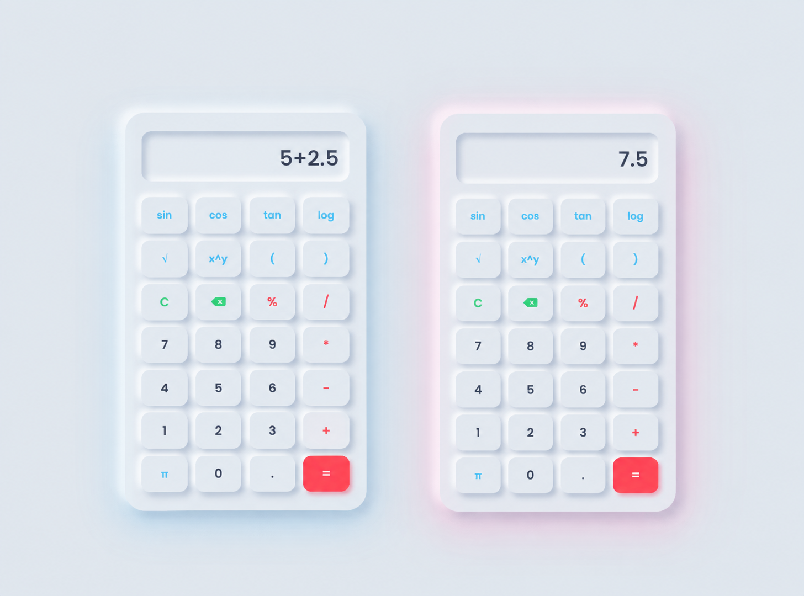
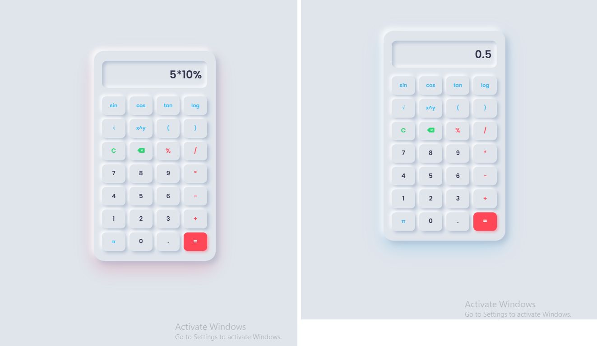

<div align="center">
  
# 🚀 OIBSIP — Oasis Infobyte Internship
  


> _"Mathematics is the most beautiful and most powerful creation of the human spirit."_  
> — **Stefan Banach**

</div>

---

## 📖 About The Project

This repository contains the **Level 2 - Task 1** project completed during my **Web Development Internship** at **Oasis Infobyte**. The project is a robust, visually striking scientific calculator web application capable of handling both standard arithmetic and advanced scientific computations.

| 📋 Detail             | 📌 Info                       |
| :-------------------- | :---------------------------- |
| **Internship Period** | August 2026                   |
| **Track**             | Web Development & Designing   |
| **Task**              | Level 2 - Task 1 (Calculator) |
| **Technology**        | HTML5, CSS3, JavaScript       |
| **Status**            | ✅ Completed                  |

---

## 🚀 Task 1: Scientific Calculator

A fully functional calculator that goes beyond the basics, wrapped in a modern, floating 3D Neumorphic design.

<p align="center">
  
</p>

---

### ✨ Key Features

<details>
<summary><b>📌 Click to expand all features</b></summary>

| #   | Feature                  | Description                                                                                         |
| --- | ------------------------ | --------------------------------------------------------------------------------------------------- |
| 1   | **Neumorphic 3D Design** | Custom floating animations and glowing soft shadows.                                                |
| 2   | **Scientific Functions** | Integrated JavaScript `Math` object for `sin()`, `cos()`, `tan()`, `log()`, `√`, and `π`.           |
| 3   | **Basic Operations**     | Flawless mathematical evaluation of expressions (+, -, \*, /, %).                                   |
| 4   | **Error Handling**       | Safe `eval()` parsing with `try...catch` blocks to detect invalid inputs and return "Syntax Error". |
| 5   | **Float Precision**      | Rounded calculations (`toFixed`) to prevent JavaScript decimal/floating-point bugs.                 |
| 6   | **Input Management**     | Functional Clear (C) and Delete (DEL) buttons for easy corrections.                                 |
| 7   | **Responsive Grid**      | Clean CSS Grid layout (`repeat(4, 1fr)`) perfectly adapting to all screen sizes.                    |

</details>

---

### 🛠️ Technologies Used

<p align="center">
  
  
  
  
  
</p>

---

### 📸 Screenshots

<p align="center">
  
  
  
</p>

---

### 🌐 Live Demo

<p align="center">
  <a href="https://tahminakhanNipa10-codes.github.io/OIBSIP/WebDev-L2-Calculator/">
    
  </a>
</p>

🔗 **Direct Link:** [https://tahminakhanNipa10-codes.github.io/OIBSIP/WebDev-L2-Calculator/](https://tahminakhanNipa10-codes.github.io/OIBSIP/WebDev-L2-Calculator/)

---

### 📁 Folder Structure

```text
OIBSIP/
└── WebDev-L2-Calculator/
    ├── index.html
    ├── style.css
    ├── script.js
    ├── README.md
    └── screenshots/
        ├── DesktopView.png
        └── calculation.png
        └── error.png
        └── percentage.png
```
🛠️ How to Run Locally
<details>
 <summary><b>📌 Click to expand instructions</b></summary>
Step 1: Clone the Repository

git clone [https://github.com/TahminaKhanNipa10-Codes/OIBSIP.git](https://github.com/TahminaKhanNipa10-Codes/OIBSIP.git)

Step 2: Navigate to the Project Directory

cd OIBSIP/WebDev-L2-Calculator/

Step 3: Open the Project

Simply double-click the index.html file to open it in your default web browser, or use an extension like Live Server in VS Code.
</details>

🤝 Connect with Me

🙏 Acknowledgements

A special thanks to Oasis Infobyte for providing this wonderful internship opportunity that helped enhance my front-end development skills!
