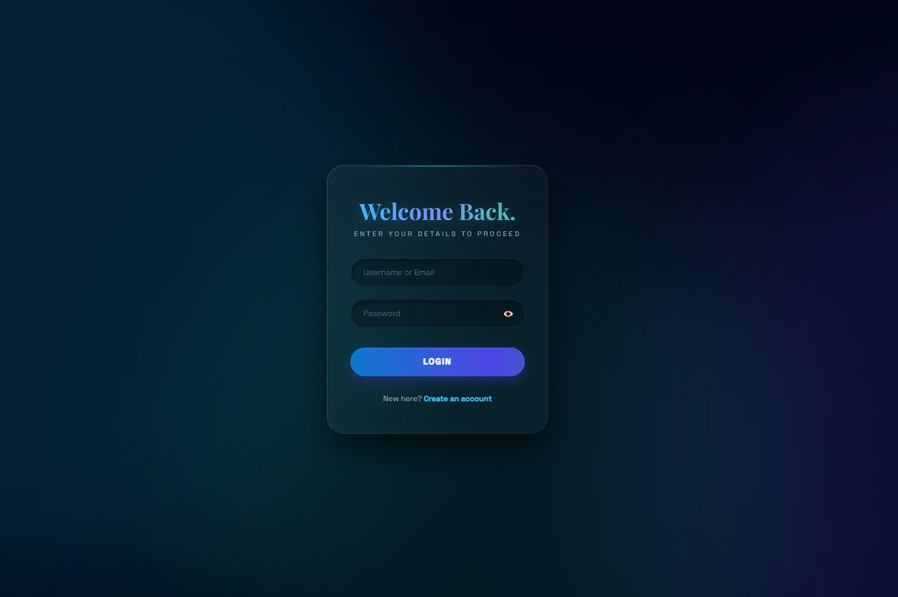
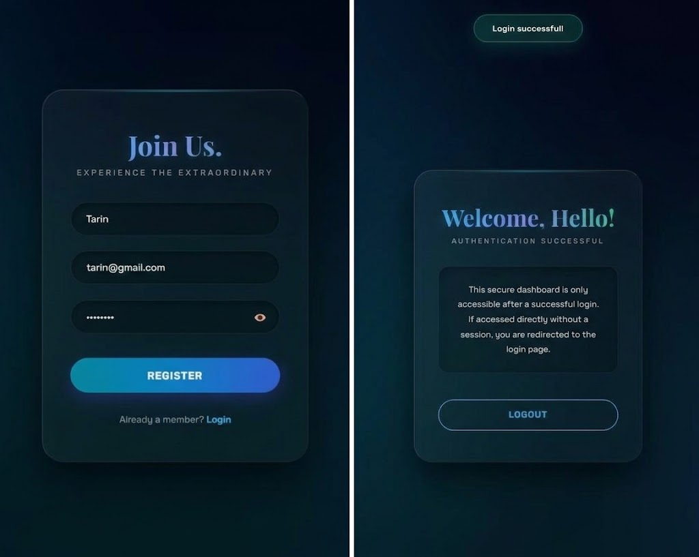
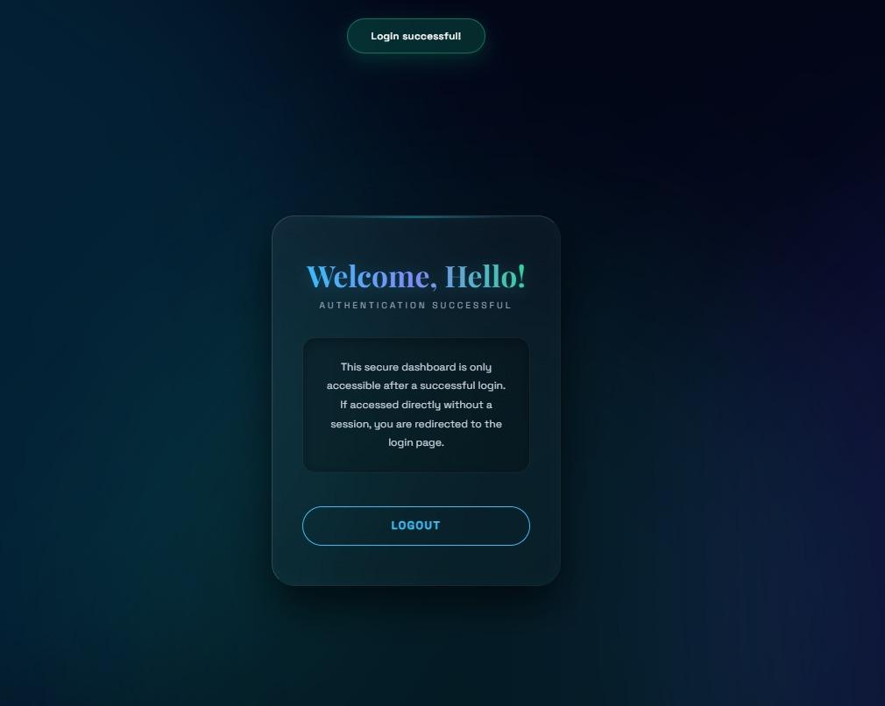
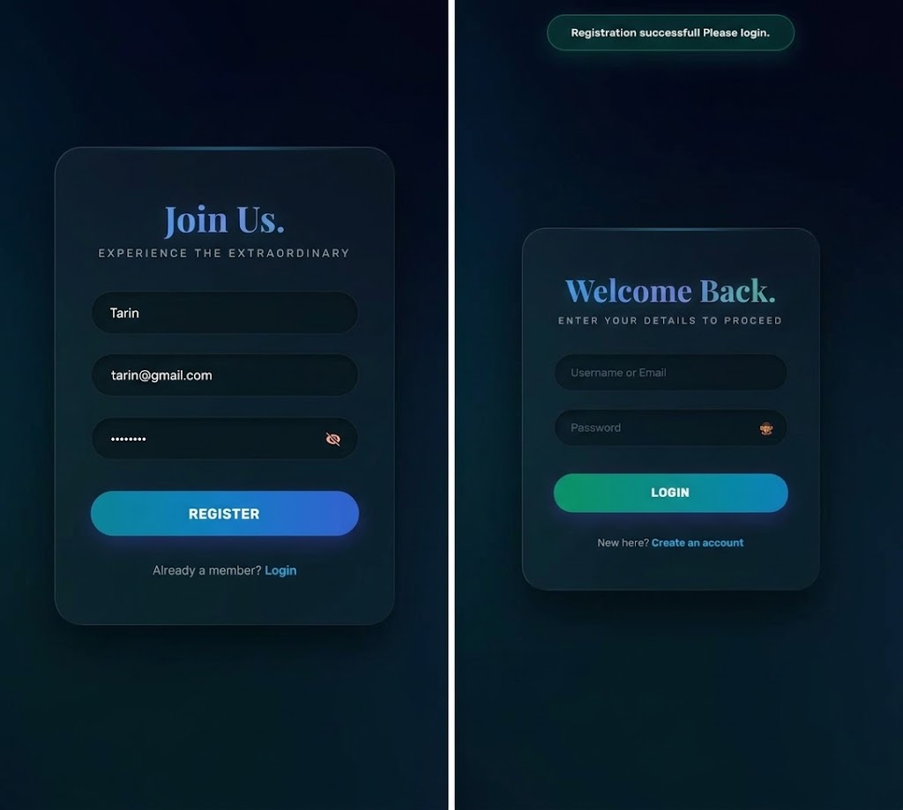

<div align="center">
  
# 🚀 OIBSIP — Oasis Infobyte Internship
  


> _"Security is not a product, but a process. A well-designed authentication system is the first line of defense."_

</div>

---

<p align="center">
  
</p>

## 📖 About The Project

This repository contains the **Login Authentication System** project completed during my **Web Development Internship** at **Oasis Infobyte**. It is a secure, client-side authentication application featuring a premium "Mystic Bioluminescence" UI with 3D glassmorphism effects.

| 📋 Detail             | 📌 Info                              |
| :-------------------- | :----------------------------------- |
| **Internship Period** | August 2026                          |
| **Track**             | Web Development & Designing          |
| **Task**              | Task 4 (Login Authentication System) |
| **Technology**        | HTML5, CSS3, Vanilla JavaScript      |
| **Status**            | ✅ Completed                         |

---

### ✨ Key Features

- **Secure Authentication:** Implements **SHA-256 Hashing** via Web Crypto API to ensure passwords are never stored in plain text.
- **Session Management:** Utilizes `localStorage` for database simulation and `sessionStorage` for active login sessions.
- **Advanced Validation:** Includes strict password policies (minimum 8 characters, at least 1 number) and duplicate user/email checks.
- **Route Protection:** Features a protected dashboard page that strictly redirects unauthorized users back to the login screen.
- **Premium UI/UX:** Designed with an immersive deep-ocean aesthetic, pill-shaped inputs, continuous animated gradient buttons, and responsive toast notifications.

---

### 📸 Screenshots

<p align="center">
  
</p>
<p align="center">
  
</p>
<p align="center">
  
</p>
<p align="center">
  
</p>

_(Note: The images above showcase the default login view, active input states, and successful registration notifications)._

---

### 🎥 Video Demo

[▶️ **Click Here to Watch the Login System Demo Video**](https://github.com/TahminaKhanNipa10-Codes/OIBSIP/raw/main/WebDev-L2-LoginSystem/LoginSystem.mp4)

_(Note: Click the link above to view the raw video presentation of the project)._

---

### 🌐 Live Demo

<p align="left">
  <a href="https://tahminakhanNipa10-codes.github.io/OIBSIP/WebDev-L2-LoginSystem/">
    
  </a>
</p>

---

### 📂 Folder Structure

```text
OIBSIP/
└── WebDev-L2-LoginSystem/
    ├── screenshots/
    │   ├── login_default.png
    │   ├── login_success.png
    │   ├── dashboard.png
    │   └── reg_success.png
    ├── index.html
    ├── style.css
    ├── script.js
    ├── LoginSystem.mp4
    └── README.md
```

🛠️ How to Run Locally
Step 1: Clone the Repository

git clone [https://github.com/TahminaKhanNipa10-Codes/OIBSIP.git](https://github.com/TahminaKhanNipa10-Codes/OIBSIP.git)

Step 2: Navigate to the Project Directory

cd OIBSIP/WebDev-L2-LoginSystem/

Step 3: Open the Project
Simply double-click the index.html file to open it in your default web browser, or use an extension like Live Server in VS Code.

🤝 Connect with Me
🙏 Acknowledgements
A special thanks to Oasis Infobyte for providing this wonderful internship opportunity that helped enhance my front-end development and security implementation skills!
