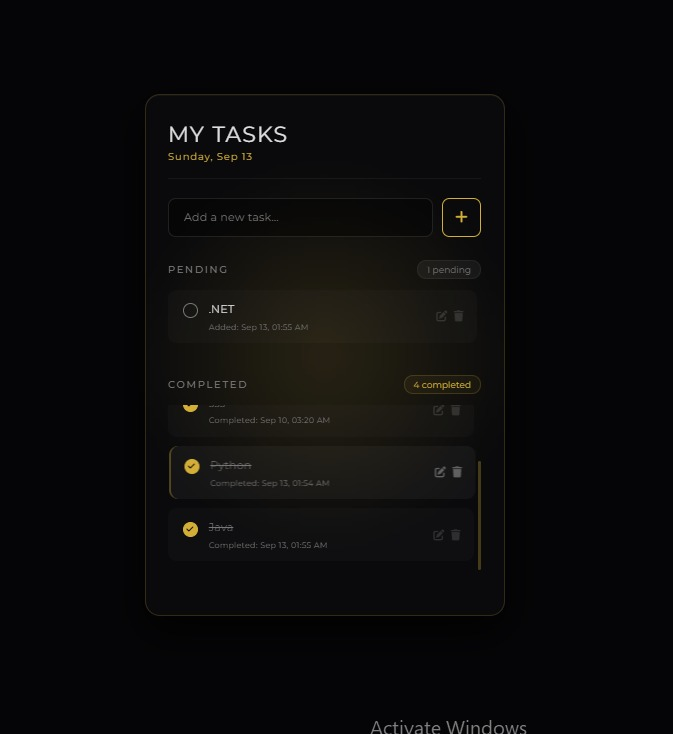
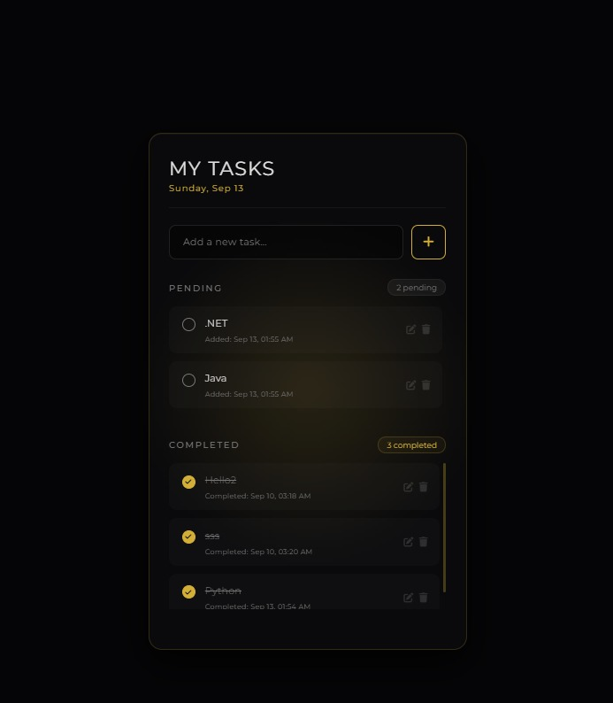
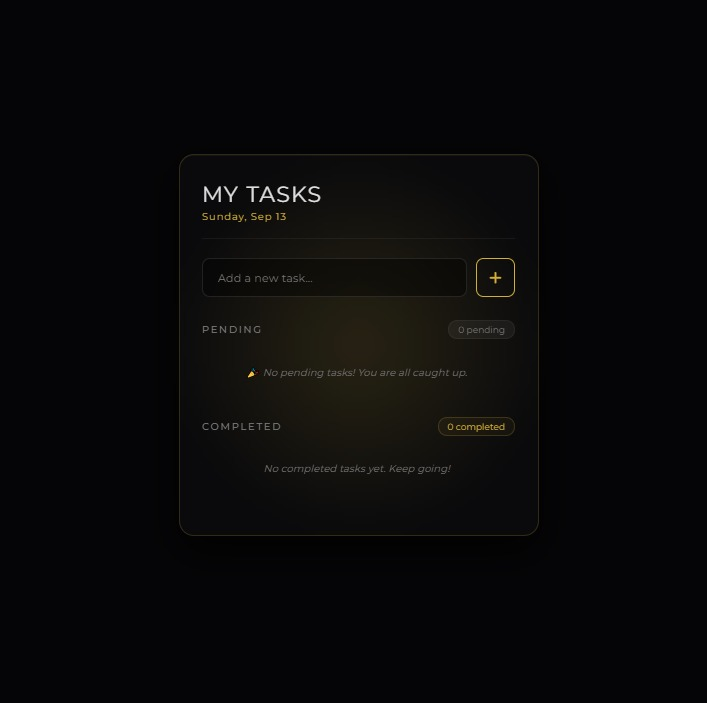

<div align="center">
  
# 🚀 OIBSIP — Oasis Infobyte Internship
  


> _"Productivity is never an accident. It is always the result of a commitment to excellence, intelligent planning, and focused effort."_

</div>

---

## 📖 About The Project

This repository contains the **Level 2 - Task 3** project completed during my **Web Development Internship** at **Oasis Infobyte**. The project is an advanced, fully functional To-Do Web Application featuring data persistence and a premium "Dark & Gold" user interface.

| 📋 Detail             | 📌 Info                         |
| :-------------------- | :------------------------------ |
| **Internship Period** | August 2026                     |
| **Track**             | Web Development & Designing     |
| **Task**              | Level 2 - Task 3 (To-Do WebApp) |
| **Technology**        | HTML5, CSS3, Vanilla JavaScript |
| **Status**            | ✅ Completed                    |

---

### ✨ Key Features

- **Data Persistence:** Utilizes browser `LocalStorage` so tasks remain saved even after a page refresh.
- **Full CRUD Operations:** Users can easily Add, Read, Update (Inline Editing), and Delete tasks.
- **Smart Tracking & Timestamps:** The app dynamically tracks exactly when a task was added or marked as completed.
- **Elite UI/UX:** Features a premium dark mode aesthetic with soft gold glowing accents, custom badges, and smooth interactive transitions.

---

### 📸 Screenshots

<p align="center">
  
</p>
<p align="center">
  
</p>
<p align="center">
  
</p>

_(Note: The images above showcase the application's interface and task management state)._

---

### 🎥 Video Demo

[▶️ **Click Here to Watch the To-Do WebApp Demo Video**](https://github.com/TahminaKhanNipa10-Codes/OIBSIP/raw/main/WebDev-L2-ToDoWebApp/ToDoWebApp.mp4)

_(Note: Click the link above to view the raw video presentation of the project)._

---

### 🌐 Live Demo

<p align="left">
  <a href="https://tahminakhanNipa10-codes.github.io/OIBSIP/WebDev-L2-ToDoWebApp/">
    
  </a>
</p>

---

### 📂 Folder Structure

```text
OIBSIP/
└── WebDev-L2-ToDoWebApp/
    ├── index.html
    ├── style.css
    ├── script.js
    ├── screenshots/
    │   ├── taskCompleted.jpeg
    │   ├── pending.jpeg
    │   └── emptyTask.jpeg
    ├── ToDoWebApp.mp4
    └── README.md
```

🛠️ How to Run Locally
<details>
 <summary><b>📌 Click to expand instructions</b></summary>
Step 1: Clone the Repository

git clone [https://github.com/TahminaKhanNipa10-Codes/OIBSIP.git](https://github.com/TahminaKhanNipa10-Codes/OIBSIP.git)

Step 2: Navigate to the Project Directory

cd OIBSIP/WebDev-L2-ToDoWebApp/

Step 3: Open the Project
Simply double-click the index.html file to open it in your default web browser, or use an extension like Live Server in VS Code.
</details>
🤝 Connect with Me

🙏 Acknowledgements
A special thanks to Oasis Infobyte for providing this wonderful internship opportunity that helped enhance my front-end development skills!
