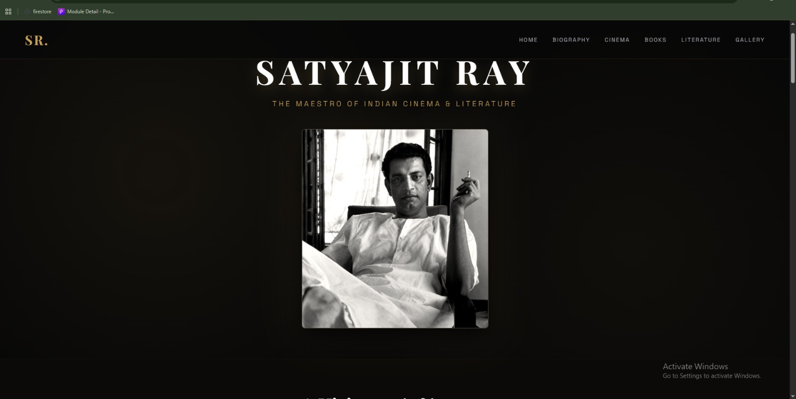
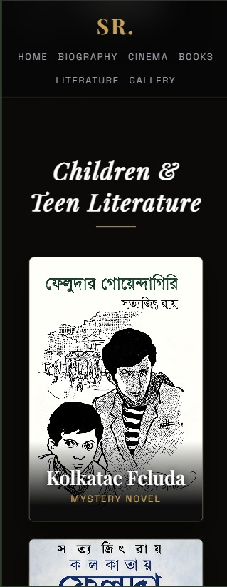
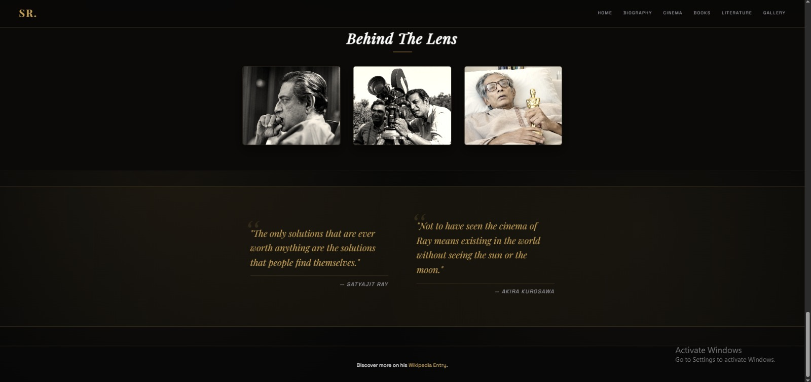
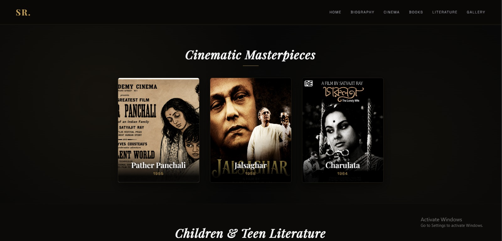
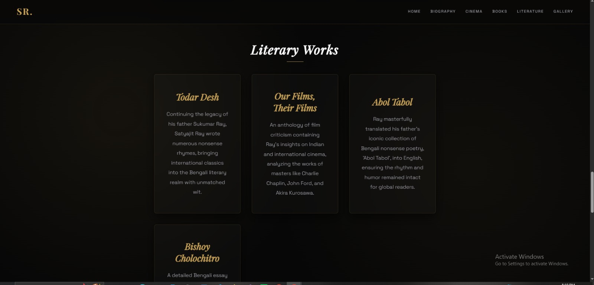
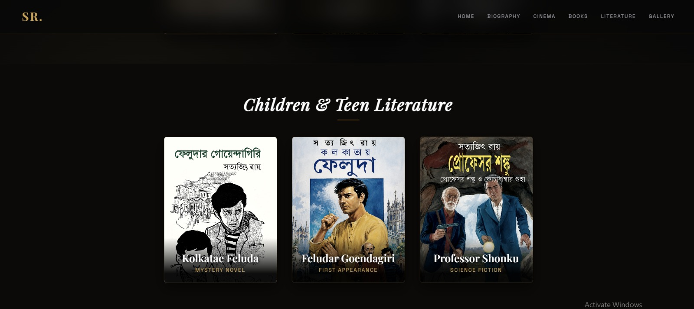

<div align="center">
  
# 🚀 OIBSIP — Oasis Infobyte Internship
  


> _"Not to have seen the cinema of Ray means existing in the world without seeing the sun or the moon."_  
> — **Akira Kurosawa**

</div>

---

## 📖 About The Project

This repository contains the **Level 2 - Task 2** project completed during my **Web Development Internship** at **Oasis Infobyte**. The project is an elegantly designed, highly responsive tribute page dedicated to the maestro of Indian Cinema and Literature, Satyajit Ray.

| 📋 Detail             | 📌 Info                         |
| :-------------------- | :------------------------------ |
| **Internship Period** | August 2026                     |
| **Track**             | Web Development & Designing     |
| **Task**              | Level 2 - Task 2 (Tribute Page) |
| **Technology**        | HTML5, CSS3, Vanilla JavaScript |
| **Status**            | ✅ Completed                    |

---

## 🚀 Task 2: Tribute Page

A visually engaging tribute page that adheres to strict professional design requirements, featuring a comprehensive biography, a chronological timeline, and an interactive gallery.

---

### ✨ Key Features

<details>
<summary><b>📌 Click to expand all features</b></summary>

| #   | Feature                    | Description                                                                                                        |
| --- | -------------------------- | ------------------------------------------------------------------------------------------------------------------ |
| 1   | **Glassmorphism UI**       | Modern translucent content cards with dynamic hover effects using `backdrop-filter`.                               |
| 2   | **Dual-Theme Backgrounds** | Strategically uses alternating background colors to separate sections elegantly.                                   |
| 3   | **Typography Hierarchy**   | Explores 2 distinct font families (`Playfair Display` for serif headings and `Space Grotesk` for sans-serif body). |
| 4   | **Interactive Timeline**   | A beautifully styled custom chronological timeline highlighting key milestones.                                    |
| 5   | **Quote Grid**             | A dedicated quote block featuring notable insights from and about Satyajit Ray.                                    |
| 6   | **Image Modals**           | Custom JavaScript-powered interactive modals for viewing gallery images in detail.                                 |
| 7   | **Responsive Layout**      | Flawless adaptation across mobile, tablet, and desktop viewing utilizing CSS Grid and Flexbox.                     |

</details>

---

### 🛠️ Technologies Used

<p align="center">
  
  
  
  
  
  
</p>

---

### 📸 Screenshots

**💻 Desktop View**
<<<<<<< HEAD

<p align="center">
  
</p>

**📱 Mobile View**

=======
<p align="center">
  
</p>

**📱 Mobile View**
>>>>>>> b5afae56af4da81f407af7adb01afed3171b80f5
<p align="center">
  
</p>

**🖼️ Sections & Modals**
<<<<<<< HEAD

=======
>>>>>>> b5afae56af4da81f407af7adb01afed3171b80f5
<p align="center">
  
  
</p>
<p align="center">
   
   
</p>

---

### 🌐 Live Demo

<p align="center">
  <a href="https://tahminakhanNipa10-codes.github.io/OIBSIP/WebDev-L2-TributePage/">
    
  </a>
</p>

🔗 **Direct Link:** [https://tahminakhanNipa10-codes.github.io/OIBSIP/WebDev-L2-TributePage/](https://tahminakhanNipa10-codes.github.io/OIBSIP/WebDev-L2-TributePage/)

---

### 📁 Folder Structure

```text
OIBSIP/
└── WebDev-L2-TributePage/
    ├── screenshots/
    │   ├── desktopview.jpeg
    │   ├── mobileview.jpeg
    │   ├── gellary.jpeg
    │   ├── literatures.jpeg
    │   ├── books.jpeg
    │   └── cinema.jpeg
    ├── images/
    │   ├── image_7a4be0.jpg
    │   ├── feludar_goendagiri.jpg
    │   └── professors.png
    ├── index.html
    ├── style.css
    ├── script.js
    └── README.md
<<<<<<< HEAD
---
=======
---  
>>>>>>> b5afae56af4da81f407af7adb01afed3171b80f5
```
 🛠️ How to Run Locally
<details>
 <summary><b>📌 Click to expand instructions</b></summary>
Step 1: Clone the Repository

<<<<<<< HEAD
🛠️ How to Run Locally

<details>
 <summary><b>📌 Click to expand instructions</b></summary>
Step 1: Clone the Repository

git clone [https://github.com/TahminaKhanNipa10-Codes/OIBSIP.git](https://github.com/TahminaKhanNipa10-Codes/OIBSIP.git)

Step 2: Navigate to the Project Directory

=======
git clone [https://github.com/TahminaKhanNipa10-Codes/OIBSIP.git](https://github.com/TahminaKhanNipa10-Codes/OIBSIP.git)

Step 2: Navigate to the Project Directory

>>>>>>> b5afae56af4da81f407af7adb01afed3171b80f5
cd OIBSIP/WebDev-L2-TributePage/

Step 3: Open the Project

Simply double-click the index.html file to open it in your default web browser, or use an extension like Live Server in VS Code.
<<<<<<< HEAD

=======
>>>>>>> b5afae56af4da81f407af7adb01afed3171b80f5
</details>
🙏 Acknowledgements

A special thanks to Oasis Infobyte for providing this wonderful internship opportunity that helped enhance my front-end development and UI design skills!
